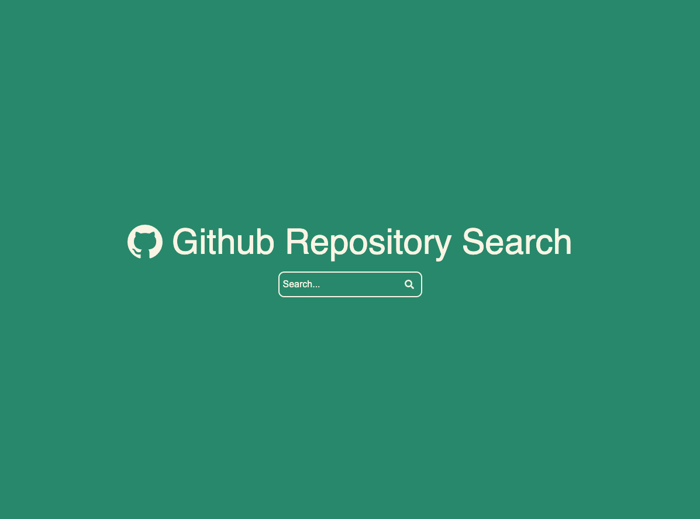
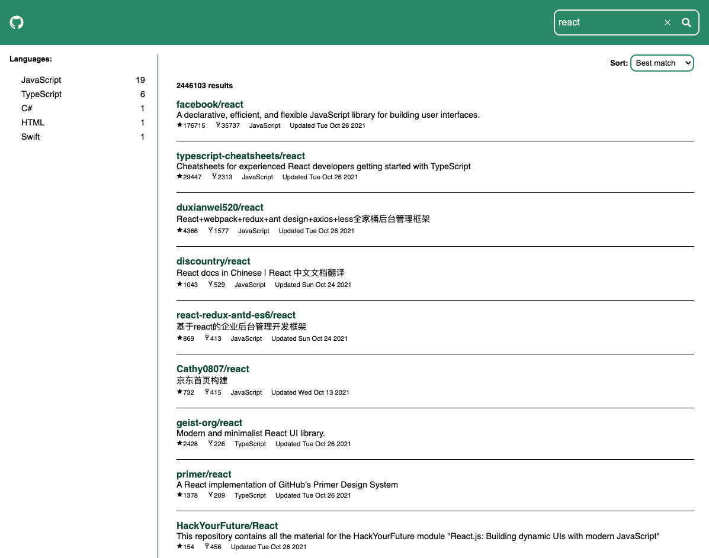
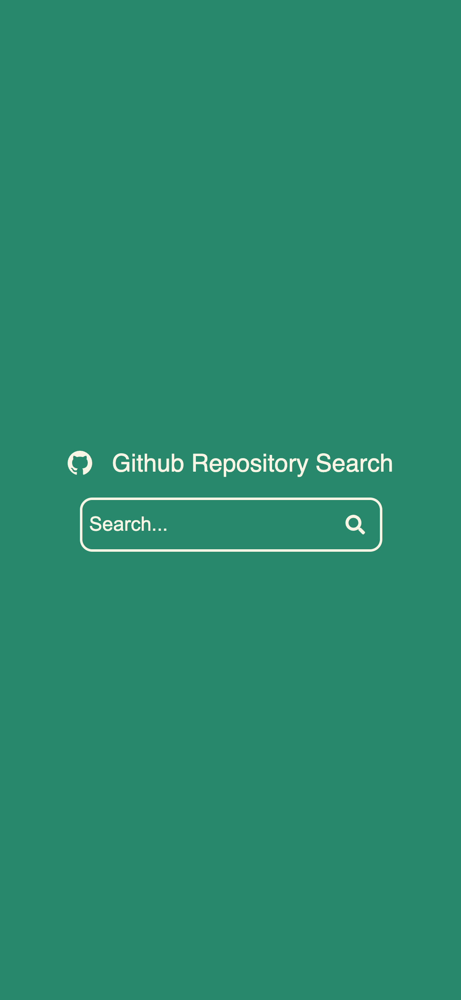
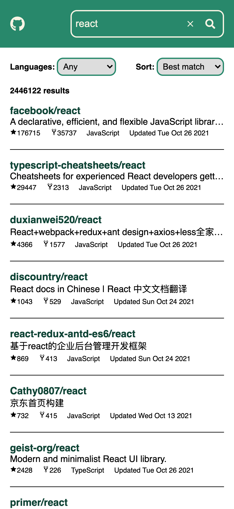
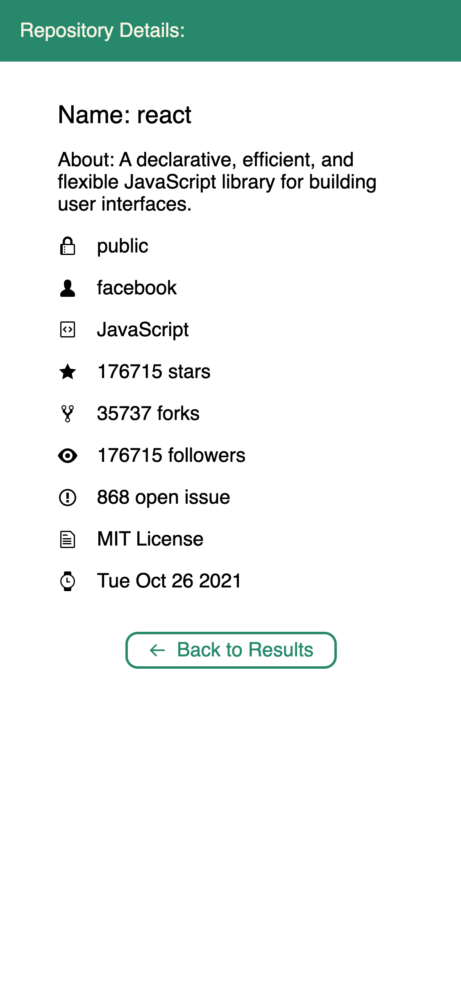

#  React Repository Search

### A repository search application using [Github's repository search API](https://docs.github.com/en/rest/reference/search#search-repositories) that displays results based on search terms. The results list can be **filtered** by languages and **sorted** by best match, stars, and forks.

## Table of contents

- [Demo](#demo)
- [Setup](#setup)
- [Technologies](#technologies)
- [Design](#design)
- [Components](#components)
- [Resources](#resources)
- [Screenshots](#screenshots)
- [License](#license)

## Demo

- Netlify: [](https://app.netlify.com/sites/reactreposearch/deploys)
- Heroku: https://reactreposearch.herokuapp.com/

## Setup

To run this project, install it locally using npm:

```
$ npm install
$ npm start
```

## Tests

To perform jest tests, run locally using npm:

```
$ npm test
```

## Technologies

Project is created with:

- React
- Javascript

## Design

A simple 3 page design that consists of a landing page, search results, and detailed page. The UI is kept clean with a simple color scheme. Number of results are displayed and adjusted based on sort and filtering. The **responsive** template supports two viewports:

- Desktop: Side Filter for Languages and Dropdow for Sort
- Mobile/Tablet: Dropdowns for Languages and Sort

## Components

- Dropdown
- Error
- Filters
- Landing
- RepoDetails
- Search
- SearchBar
- SearchResults

## Resources

- Favicon: https://favicon.io/emoji-favicons/face-with-monocle
- React Icons: https://react-icons.github.io/react-icons/
- Styled Components: [](https://github.com/styled-components/styled-components)

## Screenshots

<table>
  <tr>
    <tr>
    <th>Desktop</th>
    </tr>
  </tr>
    <td> </td>
    <td></td>
    <td></td>
   </tr> 
       <tr>
    <th>Mobile</th>
    </tr>
   <tr>
    <td></td>
    <td>
    <td>
  </td>
  </tr>
</table>

## [License](https://github.com/hemeshvpatel/ReactRepoSearch/blob/dev/LICENSE)

MIT © [Hemesh Patel](https://github.com/hemeshvpatel)
